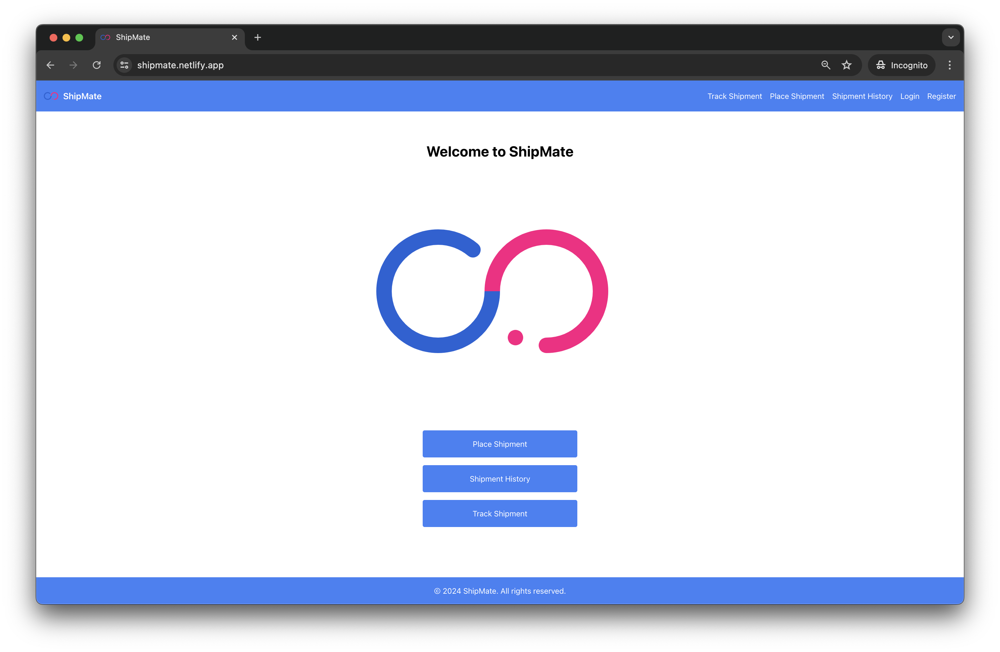

# ShipMate - Shipment Delivery Application

[Live Application](https://shipmate.netlify.app/)



## Table of Contents
- [Introduction](#introduction)
- [Features](#features)
- [Technologies Used](#technologies-used)
- [Getting Started](#getting-started)
- [Screenshots](#screenshots)


## Introduction
ShipMate is a web application enabling users to manage shipments and track their delivery status. It offers a user-friendly interface with responsive design for seamless navigation and interaction across devices.

## Features
- **User Registration and Login**: Secure authentication using Firebase.
- **Shipment Management**: Initiate new shipments with detailed information.
- **Payment Integration**: Calculate shipping charges and process payments using Razorpay.
- **Tracking System**: Monitor shipment statuses and view shipment history.
- **Responsive Design**: Accessible on various devices and screen sizes.

## Technologies Used
- **Frontend**: React, Tailwind CSS
- **Backend**: Firebase (Authentication, Firestore)
- **Payment Gateway**: Razorpay
- **Deployment**: Netlify

## Getting Started

### Prerequisites
- Node.js
- Firebase account
- Razorpay account

### Installation
1. Clone the repository:
   ```bash
   git clone https://github.com/sourajit0/ShipMate.git
   cd ShipMate
   ```

2. Install dependencies:
   ```bash
   npm install
   ```

### Set Up Firebase

1. **Create a Firebase Project**:
   - Go to the [Firebase Console](https://console.firebase.google.com/).
   - Click on "Add project" and follow the setup wizard to create a new project.

2. **Enable Authentication and Firestore**:
   - In the Firebase Console, navigate to the "Authentication" section and click on "Get Started" to enable authentication methods (e.g., Email/Password).
   - Go to the "Firestore Database" section and click on "Create database" to set up Firestore.

3. **Add Firebase Configuration**:
   - In your Firebase project settings, find the "General" tab and scroll down to "Your apps" section. Click on the web icon (</>) to register your app.
   - Copy the Firebase config object from the Firebase Console.
   - Create a `.env` file in the root of your project (if it doesn't already exist) and add the Firebase config as follows:
     ```env
     REACT_APP_FIREBASE_API_KEY=your_api_key
     REACT_APP_FIREBASE_AUTH_DOMAIN=your_auth_domain
     REACT_APP_FIREBASE_PROJECT_ID=your_project_id
     REACT_APP_FIREBASE_STORAGE_BUCKET=your_storage_bucket
     REACT_APP_FIREBASE_MESSAGING_SENDER_ID=your_messaging_sender_id
     REACT_APP_FIREBASE_APP_ID=your_app_id
     REACT_APP_FIREBASE_MEASUREMENT_ID=your_measurement_id
     ```

### Set Up Razorpay

1. **Create a Razorpay Account**:
   - Go to the [Razorpay Dashboard](https://dashboard.razorpay.com/).
   - Sign up or log in to your account and navigate to the "API Keys" section under the "Settings" tab.

2. **Obtain API Keys**:
   - Generate new API keys and copy the `Key ID` and `Key Secret`.

3. **Add API Keys to the `.env` File**:
   - In the same `.env` file where you added Firebase config, add the Razorpay API keys:
     ```env
     REACT_APP_RAZORPAY_KEY_ID=your_key_id
     REACT_APP_RAZORPAY_KEY_SECRET=your_key_secret
     ```

### Start the Development Server
1. **Run the Development Server**:
   ```bash
   npm start
   ```

## Screenshots


